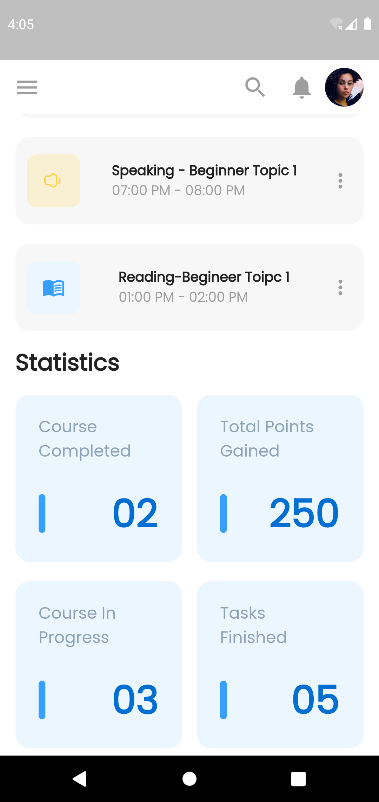
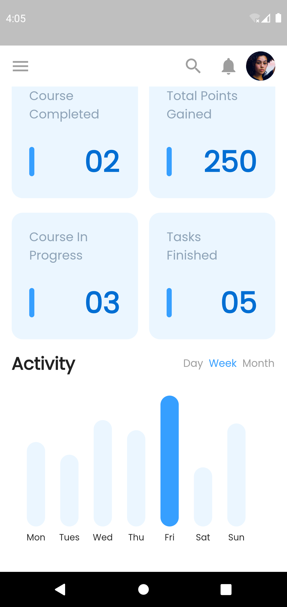

# Mobile DashBoard Ui

Dashboard App UI build using Flutter. Made with GridView, Drawer, List, Bar Chart.

## Libraries & Tools Used.
- [fl_chart](https://pub.dev/packages/fl_chart): Version-0.36.1
- [percent_indicator](https://pub.dev/packages/percent_indicator): Version-4.2.2
- [ternav_icons](https://pub.dev/packages/ternav_icons): Version-1.0.0
- [cupertino_icons](https://pub.dev/packages/cupertino_icons): Version-1.0.2

### App Screenshots
   
 

